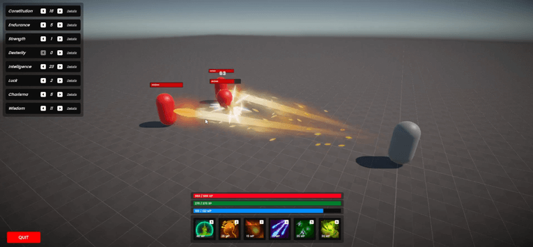
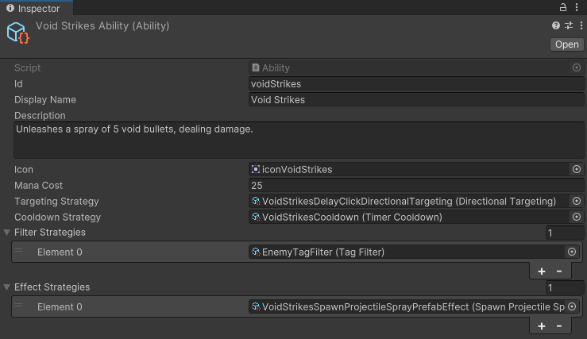
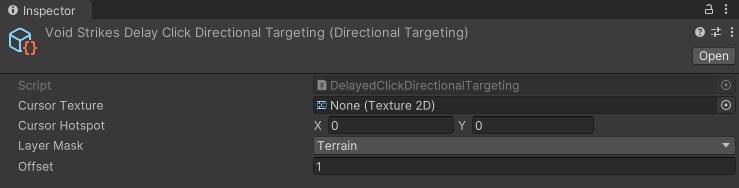
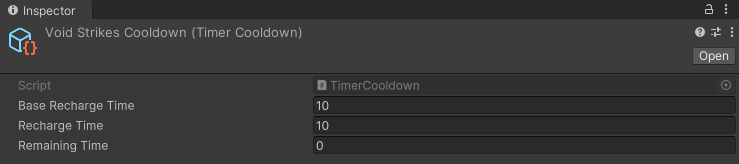
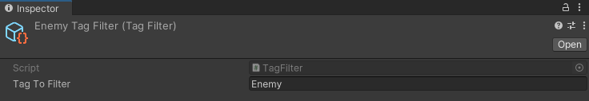
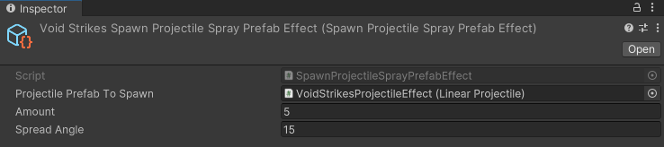
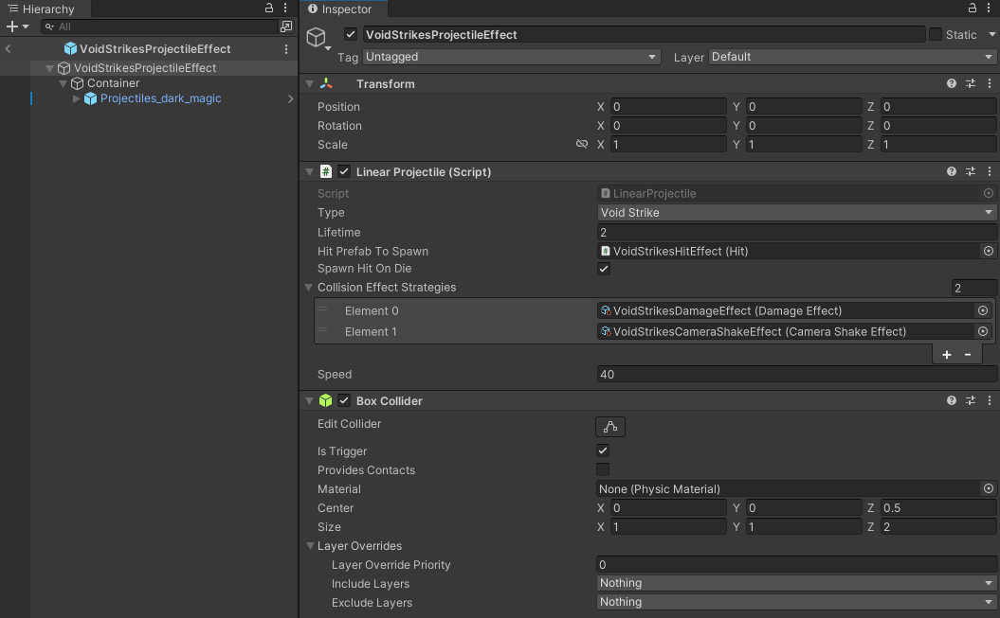
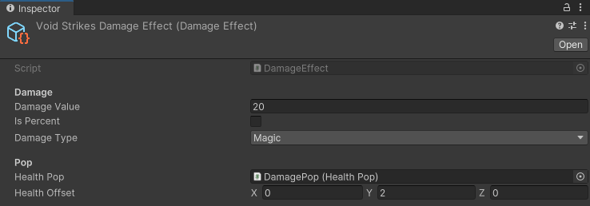
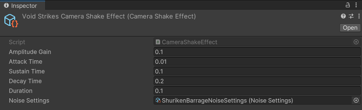

# Unity GAS

## Overview

This project implements a **Gameplay Ability System (GAS)** in Unity. The GAS provides a framework for defining and executing abilities for characters in a game, allowing for modular, reusable, and scalable gameplay mechanics.

## Features

Each ability in this system is composed of multiple interchangeable **ScriptableObjects**, making it easy for designers to create, modify, and balance abilities without needing to write code. This modular approach ensures that abilities can be customized and fine-tuned with ease, providing a flexible toolkit for game designers.

- **Ability Definitions**: Create and manage abilities with various effects, such as damage, healing, buffs, debuffs, and more.
- **Attribute System**: Manage character attributes (e.g., health, mana, stamina) and integrate them with abilities.
- **Pool System**: Use events to trigger and respond to ability-related actions to release objects when needed.

### Abilities

The system allows for the creation of abilities that can perform a wide range of actions. Each ability can have different components, including:

- **Targeting System**: Define and handle different targeting methods for abilities.

  - Area-of-effect (AoE)
    - Circle Zone
    - Square Zone
    - _More to come (WIP)_
  - Single-target
  - Self-targeting.
  - Directional.

- **Cooldown and Cost Management**: Implement cooldowns and mana cost for abilities:

  - Time cooldown
  - Stack cooldown
  - Mana cost

- **Filters**: Define criteria to select only targets that meet specific requirements.

  - Tags (Player, Enemy..)
  - Health (Dead, Alive, Health Amount...)
  - _More to come (WIP)_

- **Effects**: Implement list of effects.

  - Health
    - Damage
    - Heal
  - Animation
    - Set Boolean variable
    - Set Float variable
    - Set Trigger variable
  - Camera
    - Camera Shake
  - Buff / Debuff
    - Stats
    - _More to come (WIP)_
  - Spawn
    - Spawn Prefab
    - Spawn Prefab at target
    - Spawn Projectile Prefab
    - Spawn Projectile Spray Prefab
    - Spawn Projectile Barrage Prefab
    - _More to come (WIP)_
  - Transform
    - Look At Target
  - Composite

    - Delay

  - _More to come (WIP)_

#### Ability Example

Let’s take the **Void Strikes** ability as an example and break it down.

It consists of:

- **ID** : voidSrikes
- **Name** : Void Srikes
- **Description**: Unleashes a spray of 5 void bullets, dealing damage.
- **Icon** : Image field
- **Mana Cost**: 25

* **Targeting Strategy**: Directional Targeting
  
* **Cooldown Strategy**: Timer Cooldown
  

- **Filter Strategies**: Enemy Filter
  
- **Effect Strategies**: Spawn Projectile Spray Prefab
  

  - Here's the projectile prefab
    

    **Collision Effect Stategies**:

    - Damage Effect
      

    - Camera Shake
      

### Stats and Derived Stats

The GAS includes a robust system for managing character stats and derived stats, which are used to calculate various in-game effects and outcomes. These stats are crucial in determining a character's effectiveness in combat, resource management, and overall gameplay performance.

#### Base Stats

Base stats are the fundamental attributes of a character. These stats influence the derived stats and directly affect the character's capabilities. The following base stats are included:

- **Constitution**:
  - Increases the maximum amount of health a character can have.
- **Endurance**:
  - Increases the maximum amount of stamina a character can possess.
  - Accelerates the rate at which a character replenishes stamina.
- **Strength**:

  - Enhances the damage a character deals through physical attacks.
  - Increases the maximum weight of items a character can carry without penalties. _(Weight system not yet implemented)_

- **Dexterity**:
  - Improves a character's ability to land hits on a target. _(Accuracy system not yet implemented)_
  - Increases the rate at which a character can perform consecutive attacks. _(Attack speed system not yet implemented)_
  - Raises the likelihood of a character landing a critical hit, causing extra damage. _(Critical Hit Chance system not yet implemented)_
  - Increases a character's ability to avoid incoming attacks. _(Evasion system not yet implemented)_
  - Enhances the speed at which a character moves across the game world. _(Movement speed system not yet implemented)_
- **Intelligence**:
  - Boosts the amount of damage a character inflicts with magical abilities.
  - Boosts a character's ability to resist or reduce magic damage taken
- **Luck**: System not yed implemented.
- **Charisma**: System not yed implemented.
- **Wisdom**:
  - Reduces the time it takes for a character's abilities to become usable again after being cast.
  - Increases the maximum amount of mana available for casting spells.
  - Accelerates the rate at which a character replenishes mana.

These stats are designed to provide a deep and flexible system for character customization and progression, allowing for a wide range of gameplay styles and strategies.

#### Derived Stats

Derived stats are calculated based on the base stats and determine various in-game effects. These stats are automatically updated when the base stats change. The following derived stats are included:

- **MaxHealth**: The maximum amount of health a character can have.
- **MaxMana**: The maximum amount of mana a character can have.
- **MaxStamina**: The maximum amount of stamina a character can have.
- **MagicDamage**: The amount of damage dealt by magical abilities.
- **PhysicalDamage**: The amount of damage dealt by physical attacks.
- **Accuracy**: The likelihood of hitting a target. _(Not yet implemented)_
- **Evasion**: The likelihood of avoiding an attack. _(Not yet implemented)_
- **CriticalHitChance**: The chance of dealing a critical hit. _(Not yet implemented)_
- **MovementSpeed**: The speed at which a character moves. _(Not yet implemented)_
- **AttackSpeed**: The speed at which a character can attack. _(Not yet implemented)_
- **MagicResistance**: The character's ability to resist magical damage.
- **PhysicalResistance**: The character's ability to resist physical damage.
- **HealthRegeneration**: The rate at which a character regenerates health over time.
- **StaminaRegeneration**: The rate at which a character regenerates stamina over time.
- **ManaRegeneration**: The rate at which a character regenerates mana over time.
- **AbilityCooldown**: The reduction in cooldown time for abilities.
- **MaxWeight**: The maximum amount of weight a character can carry. _(Not yet implemented)_
